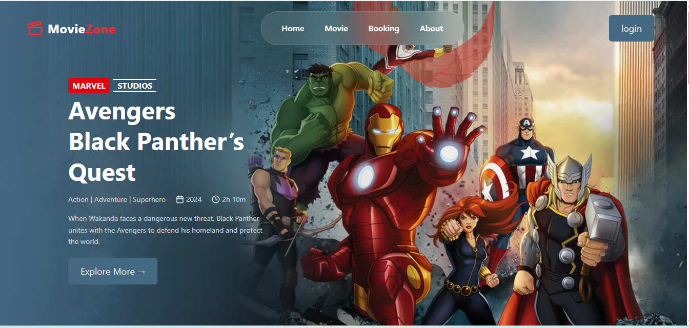

🎬 Movie Zone

Movie Zone is a modern and responsive Movie Ticket Booking Web Application built using React.js. It allows users to explore movies, select seats, and book tickets with an interactive and user-friendly interface.

🌟 Features

.  Browse available movies

.  Interactive seat selection system

.  Automatic ticket price calculation

.  Select & deselect seats easily

.  Mobile & laptop responsive design

.  Clean UI with a consistent color theme

🛠️ Tech Stack

. Frontend: React.js

. Styling: Tailwind CSS

. Build Tool: Vite

. Language: JavaScript (ES6+)

. Package Manager: npm

🎯 Application Flow

1 User opens Movie Zone

2 Selects a movie

3 Chooses preferred seats

4 Total price updates automatically

5 Confirms ticket booking

🌐 Live Preview  
. Hosting on Netlify  
 click on - https://reactjs-moviezone1.netlify.app/

* Home page

  
 

*  Folder structure
  
 

 1 *Clone or download the repository*  
    
   https://github.com/kalegauri31/ICP12-ReactJs-MoveZone

